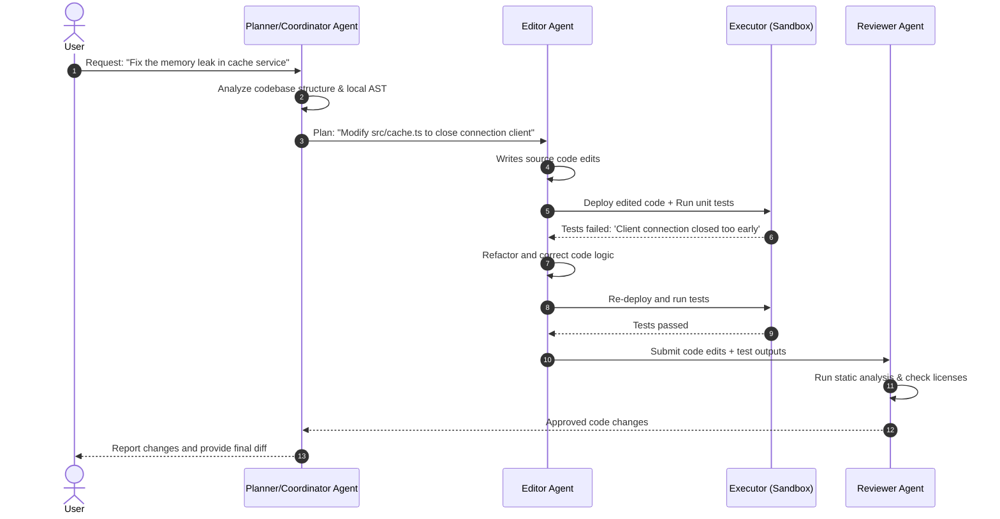

# API Design & Security Plan

This document specifies the interface design, tool-calling definitions, multi-agent coordination flows, and API security measures.

---

## 1. API Endpoint Specification

All API endpoints follow REST guidelines and use JSON as payload structures. Streaming endpoints utilize Server-Sent Events (SSE).

### Core Endpoints

#### 1. `POST /api/v1/chat/completions` (Streaming Chat)
- **Description:** Sends chat inputs to the agent and streams the response back token-by-token.
- **Request Headers:** `Authorization: Bearer <JWT_TOKEN>`
- **Request Body:**
```json
{
  "conversation_id": "e3b0c442-98fc-11ee-b9d1-0242ac120002",
  "project_id": "74198f3b-8eb0-4030-925e-5487dafd3cb2",
  "messages": [
    { "role": "user", "content": "Explain the login user function in auth.controller.ts and write a unit test for it." }
  ],
  "temperature": 0.2,
  "stream": true
}
```
- **Response Format (SSE):**
```text
data: {"token": "Sure", "finish_reason": null}
data: {"token": "!", "finish_reason": null}
data: {"token": "", "finish_reason": "stop"}
```

---

#### 2. `POST /api/v1/repos/sync` (Repository Indexing)
- **Description:** Initiates asynchronous repository cloning, AST analysis, and embedding index updates in Qdrant.
- **Request Body:**
```json
{
  "project_id": "74198f3b-8eb0-4030-925e-5487dafd3cb2",
  "github_repo_url": "https://github.com/user/myproject",
  "branch": "main"
}
```
- **Response (202 Accepted):**
```json
{
  "task_id": "idx_99182312",
  "status": "queued",
  "estimated_time_seconds": 120
}
```

---

#### 3. `POST /api/v1/sandbox/execute` (Code Execution)
- **Description:** Executes a code payload in an isolated Firecracker microVM sandbox.
- **Request Body:**
```json
{
  "language": "typescript",
  "code": "import { loginUser } from './auth.controller'; console.log(typeof loginUser);",
  "files": [
    {
      "path": "auth.controller.ts",
      "content": "export function loginUser() { return 'ok'; }"
    }
  ],
  "timeout_ms": 5000
}
```
- **Response (200 OK):**
```json
{
  "exit_code": 0,
  "stdout": "function\n",
  "stderr": "",
  "execution_time_ms": 84
}
```

---

## 2. Function Calling Schema

The CodexForge model is fine-tuned to output structured JSON markdown blocks representing tool invocations. The agent runtime parses these outputs and executes the tool.

### Prompt Tool Specification
The system prompt exposes tools like this:

```json
[
  {
    "name": "read_file",
    "description": "Read file contents from the workspace.",
    "parameters": {
      "type": "object",
      "properties": {
        "file_path": { "type": "string" }
      },
      "required": ["file_path"]
    }
  },
  {
    "name": "run_linter",
    "description": "Run eslint on a target file to verify syntax.",
    "parameters": {
      "type": "object",
      "properties": {
        "file_path": { "type": "string" }
      },
      "required": ["file_path"]
    }
  }
]
```

### Model Generation Output Format
When calling a tool, the model terminates its natural language output and generates:

```text
I need to check the imports of `auth.controller.ts` before writing the test.
```
```json
{
  "tool": "read_file",
  "arguments": {
    "file_path": "src/controllers/auth.controller.ts"
  }
}
```

---

## 3. Multi-Agent Coordination Flow

Complex coding tasks (e.g., refactoring or fixing issues on SWE-bench) require multiple specialized agent roles working in sequence. We use a **Coordinator-Worker** multi-agent loop:



---

## 4. Platform Security Plan

1. **Authentication & Authorization:**
   - **User Sessions:** Managed via JWT tokens signed using HS256/RS256 with a 15-minute lifespan. Refresh tokens are stored in an HttpOnly, Secure, SameSite=Strict cookie.
   - **External Keys:** API keys generated for external API usage are stored as cryptographically hashed records (SHA-256) inside PostgreSQL. Raw keys are displayed only once upon creation.

2. **Network Security:**
   - **VPC Separation:** The Kubernetes cluster runs inside an isolated VPC.
   - **Ingress WAF:** Cloudflare or AWS WAF is configured to intercept and block SQL injection, DDoS, and cross-site scripting (XSS) attempts.
   - **Rate Limiting:** Managed using sliding-window limits in Redis (e.g., 60 completions / minute / user).

3. **Data Security & Privacy:**
   - **Encryption at Rest:** DB volumes are encrypted using AWS KMS keys (AES-256).
   - **Encryption in Transit:** All traffic is enforced over TLS 1.3.
