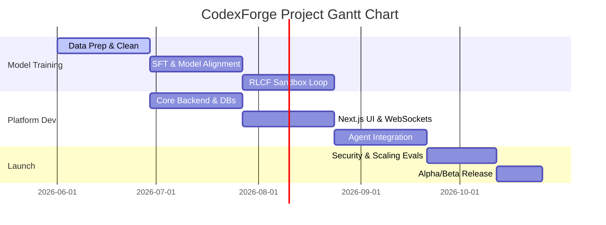

# Development Milestones & Rollout Plan

This document maps the implementation schedule and deployment roadmap for CodexForge over a 20-week execution cycle.

---

## 1. Development Milestones



### Milestone 1: Data Curation & Infrastructure Setup (Weeks 1-4)
- **Deliverables:**
  - Setup GPU cluster access and connect nodes via InfiniBand.
  - Deploy data pipeline: Permissive license filters, MinHash LSH deduplication, and syntax validation.
  - Generate the first synthetic dataset (5M tokens of code instruction and repair paths).
  - Install Qdrant, PostgreSQL, and Redis in the staging cluster.
- **Verification:**
  - Successful dry-run of the Megatron-LM training loop on a 1B test model.
  - Complete data audit ensuring no copyleft code is present in training sets.

### Milestone 2: SFT & Base Model Alignment (Weeks 5-8)
- **Deliverables:**
  - Execute continued pre-training on 2 Trillion tokens with FIM (Fill-in-the-Middle) enabled.
  - Perform the Supervised Fine-Tuning (SFT) phase for multi-turn chat, JSON function calling, and formatting instructions.
  - Implement basic evaluation pipeline running HumanEval, MBPP, and MultiPL-E metrics automatically.
- **Verification:**
  - Zero-shot HumanEval score exceeds 70%.
  - GQA (Grouped Query Attention) layer correctly verified to execute within predicted VRAM constraints.

### Milestone 3: Sandbox Development & RLCF Integration (Weeks 9-12)
- **Deliverables:**
  - Develop Sandbox Manager service controlling AWS Firecracker VM lifecycles.
  - Setup local PyPI/npm mirror cache to enable offline sandbox installs.
  - Implement RLCF (Reinforcement Learning from Compiler Feedback) running inside the Firecracker VMs.
  - Execute DPO/PPO alignment pass using test outcome rewards.
- **Verification:**
  - Average sandbox boot-to-execute cycle time falls below 80ms.
  - Model successfully runs self-repair loop on compiler errors.

### Milestone 4: Platform MVP (Weeks 13-16)
- **Deliverables:**
  - Build Next.js user interface featuring a Monaco Editor file browser, chat screen, and admin panels.
  - Deploy NestJS Core backend handling JWT/OAuth authentication, payments, and team access databases.
  - Develop FastAPI Agent backend mapping local repositories, generating embeddings, and storing payloads in Qdrant.
- **Verification:**
  - Streaming tokens via Server-Sent Events (SSE) rendered in Next.js UI.
  - Complete workspace indexing operation works correctly on repositories containing up to 1,000 files.

### Milestone 5: Optimization, Security & Production Launch (Weeks 17-20)
- **Deliverables:**
  - Apply 4-bit AWQ weight quantization to the model.
  - Deploy Speculative Decoding using a 2B parameter draft model.
  - Run penetration testing on Firecracker network isolation boundaries.
  - Setup Prometheus/Grafana monitors tracking GPU temperatures, VRAM, and user request queue sizes.
- **Verification:**
  - Output speed exceeds 60 tokens/second per stream.
  - Firecracker sandbox successfully blocks malicious filesystem/network escape test scenarios.

---

## 2. Production Rollout Strategy

To prevent system outages, database lockouts, or GPU starvation, CodexForge will release in three phases:

```
[Phase 1: Alpha (Dogfooding)] ──> [Phase 2: Private Beta] ──> [Phase 3: General Availability]
```

### Phase 1: Internal Dogfooding (Alpha)
- **Scale:** 100 internal developers.
- **Goal:** Identify edge cases in multi-file edits, track agent UI bugs, and verify sandbox performance.
- **Constraints:** Minimal cluster footprint (1 HGX H100 node serving inference).

### Phase 2: Private Beta
- **Scale:** 1,000 external developers (waitlist selection).
- **Goal:** Verify PG database query indexing performance, load test Redis queue processing, and benchmark vLLM batching parameters under load.
- **Billing:** Free access tier with hard daily limits to monitor average costs.

### Phase 3: General Availability (GA)
- **Scale:** Public launch.
- **Goal:** Full commercial operations with automated billing.
- **Security:** Active WAF rules, DDoS mitigations, and 24/7 security auditing active.
- **Infrastructure:** Multi-node GPU scaling enabled with automatic fallback to secondary region nodes.
