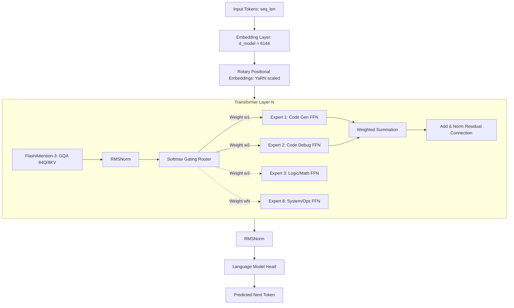

# System Architecture & Model Design Specification

This document provides a deep-dive specification of the CodexForge platform architecture and the underlying Mixture of Experts (MoE) coding model.

---

## 1. System Architecture

CodexForge is designed as a hybrid microservice architecture to decouple CPU-bound web/database operations from highly asynchronous, GPU-bound agent loops and low-latency LLM inference.

### High-Level Components

1. **Frontend (Next.js & TypeScript):**
   - **Role:** Direct user interface for chat, file exploration, repository mapping, and billing.
   - **Design:** Next.js App Router using React Server Components (RSC) to minimize client-side bundle size, and Client Components for streaming chat sessions and interactive code diff windows (using Monaco Editor).
   - **WebSockets / SSE:** Server-Sent Events (SSE) for streaming completions; WebSockets for interactive terminal sessions connected to sandboxes.

2. **Core Backend (NestJS & TypeScript):**
   - **Role:** Handles CRUD operations, database transactions, OAuth logins, team access control (RBAC), and webhooks.
   - **Design:** Structured using modular design (NestJS Modules). Communicates with PostgreSQL via Prisma ORM. Emits events to Redis Pub/Sub for background processing.
   - **Justification:** Node.js/NestJS provides superior developer velocity, robust type-safety with TypeScript, and a highly efficient non-blocking I/O loop for handling thousands of simultaneous REST/GraphQL requests.

3. **Agent Backend (FastAPI & Python):**
   - **Role:** Orchestrates the multi-agent execution loop, builds RAG contexts, searches vector databases, parses repository ASTs (Abstract Syntax Trees), and interfaces with LLM inference.
   - **Design:** Async FastAPI. Utilizes Pydantic for strict schema validation.
   - **Justification:** Python is the native ecosystem for Machine Learning, LangChain/LlamaIndex frameworks, tree-sitter (for AST parsing), and data engineering. FastAPI's native async capabilities permit high-concurrency connections to the database and LLM servers without blocking.

4. **Inference Server (vLLM / TensorRT-LLM):**
   - **Role:** Serves the LLM with sub-second time-to-first-token (TTFT).
   - **Optimization:** Utilizes PagedAttention, continuous batching, and tensor parallelism across multiple GPUs.

5. **Sandbox Environment (Firecracker MicroVMs / gVisor):**
   - **Role:** Provides secure, ephemeral, isolated environments to compile code, run tests, and execute arbitrary user code.

---

### Detailed System Architecture Diagram

```mermaid
flowchart TB
    subgraph Client Space
        Browser[Next.js Web Frontend]
    </subgraph>

    subgraph API Gateway Layer
        Ingress[Kubernetes Nginx Ingress]
    end

    subgraph Service Layer
        NestService[NestJS Core Backend]
        FastAPIAgent[FastAPI Agent Backend]
        vLLMServer[vLLM Inference Server]
    end

    subgraph Data & State Store
        Postgres[(PostgreSQL DB)]
        Redis[(Redis Cache / PubSub)]
        Qdrant[(Qdrant Vector DB)]
    end

    subgraph Execution Layer
        SandboxMgr[Sandbox Manager Service]
        VM1[Firecracker MicroVM 1]
        VM2[Firecracker MicroVM 2]
    end

    Browser <-->|HTTPS / WebSockets| Ingress
    Ingress -->|REST / WS| NestService
    Ingress -->|SSE / REST| FastAPIAgent

    NestService -->|Prisma ORM| Postgres
    NestService -->|Read/Write| Redis
    NestService -->|gRPC| SandboxMgr

    FastAPIAgent -->|gRPC/HTTP| vLLMServer
    FastAPIAgent -->|gRPC| Qdrant
    FastAPIAgent -->|Read/Write| Redis

    SandboxMgr -->|Spawns| VM1
    SandboxMgr -->|Spawns| VM2
    VM1 -.->|Callback / Logs| SandboxMgr
```

---

## 2. Neural Network Model Architecture

To maximize coding performance per watt, we deploy a **Sparse Mixture of Experts (MoE)** architecture. Instead of activating all parameters for every token, only a subset of "experts" is triggered via a gating network.

### Model Hyperparameters (Target Configuration)
- **Total Parameters:** 132 Billion (132B)
- **Active Parameters per Token:** 22 Billion (22B)
- **Number of Experts:** 8 total experts, Top-2 routing (each token is sent to the 2 best experts).
- **Sequence Length:** 128k tokens (native support).
- **KV Cache Optimization:** Grouped Query Attention (GQA) with 8 key-value heads and 64 query heads (8:1 ratio) to minimize VRAM footprint during long-context generation.

### Detailed Model Architecture Diagram



### Architectural Decisions & Technical Justifications

1. **Top-2 Routing & Sparse MoE:**
   - *Decision:* Sparse MoE with Top-2 expert selection per token.
   - *Justification:* This separates specialized skills (e.g., Python expertise vs. C++ optimization vs. conceptual explanation) while maintaining a low computational footprint. It matches the quality of a 130B dense model at 1/6th the FLOPs and inference latency.
   - *Load Balancing Loss:* We incorporate an auxiliary load-balancing loss during training to prevent "expert collapse" (where a single expert receives all routing tokens, leading to under-utilization of other experts).

2. **Grouped Query Attention (GQA):**
   - *Decision:* GQA instead of Multi-Head Attention (MHA).
   - *Justification:* Standard MHA requires storing KV cache for every attention head, which exceeds GPU memory (VRAM) limits when context windows grow to 128k. GQA groups query heads together to share KV heads, reducing the KV cache size by 8x. This allows high batch sizes and long contexts to fit within H100 memory limits.

3. **Rotary Position Embeddings (RoPE) with YaRN Scaling:**
   - *Decision:* RoPE position embeddings interpolated using YaRN (Yet another RoPE extension method).
   - *Justification:* Standard RoPE fails when extrapolating beyond the training sequence length. YaRN interpolates the attention weights across high and low frequencies, enabling the model to process 128k context windows with minimal performance degradation on short-context benchmarks.

4. **FlashAttention-3:**
   - *Decision:* Utilize FlashAttention-3 kernels.
   - *Justification:* FlashAttention-3 optimizes the memory hierarchy of modern GPUs (like NVIDIA H100 Hopper) by utilizing FP8 asynchronous tensor core instructions and hardware-accelerated TMA (Tensor Memory Accelerator), yielding a 2x speedup in training and inference over FlashAttention-2.
