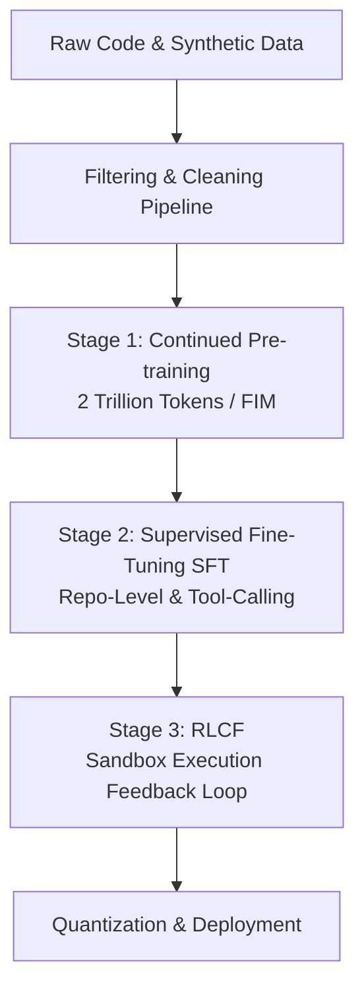

# Training & Fine-Tuning Roadmap

This document details the multi-stage dataset preparation, training pipelines, and evaluation frameworks for CodexForge.

---

## 1. Multi-Stage Training Pipeline



### Stage 1: Continued Pre-Training (Domain Adaptation)
- **Objective:** Teach the model language structure, syntax patterns, libraries, and logic across 80+ programming languages.
- **Context Size:** Starts at 8k tokens, then scales progressively to 128k using sequence packing and YaRN RoPE scaling.
- **Key Technique (Fill-in-the-Middle - FIM):**
  - Standard autoregressive models only predict code *forward*. However, IDE coding assistants need to complete code *in the middle* of a file.
  - We train the model with a 50% split on FIM formats:
    - Normal order: `<PRE> prefix <SUF> suffix <MID> middle`
    - The model learns to fill in the `<MID>` token based on surrounding context.

### Stage 2: Supervised Fine-Tuning (SFT)
- **Objective:** Train the model to act as a conversational assistant, follow complex instructions, output structured JSON for tool execution, and explain its actions.
- **Data Curation:** High-quality coding Q&A, repository-level multi-file refactoring examples, system prompt adherence, and multi-step agent debugging traces.

### Stage 3: Reinforcement Learning from Compiler Feedback (RLCF)
Coding possesses a unique advantage: code correctness can be verified automatically via compilers, interpreters, and test suites. We deploy **RLCF** using **Direct Preference Optimization (DPO)** or **PPO (Proximal Policy Optimization)**:

```
                  ┌────────────────────────┐
                  │   Prompt (Code Task)   │
                  └───────────┬────────────┘
                              ▼
                  ┌────────────────────────┐
                  │ Model Generates N Runs │
                  └───────────┬────────────┘
                              ▼
                  ┌────────────────────────┐
                  │ Executed in Sandbox    │
                  └─────┬────────────┬─────┘
                        │            │
             Passes tests            Fails compilation or tests
                        │            │
                        ▼            ▼
                  ┌──────────┐  ┌──────────┐
                  │ Reward + │  │ Reward - │
                  └────┬─────┘  └────┬─────┘
                       │             │
                       └──────┬──────┘
                              ▼
                  ┌────────────────────────┐
                  │  Model Weights Update  │
                  └────────────────────────┘
```

---

## 2. Dataset Recommendations & Data Cleaning Pipeline

### Raw Datasets
1. **The Stack v2:** Largest permissive code dataset (MIT, Apache, BSD licenses).
2. **GitHub Archive:** Git commit histories to train the model on how code evolves and how diffs/PRs are generated.
3. **Synthetic Datasets:** High-quality code explanations, unit test definitions, and step-by-step bug repairs generated using larger proprietary models (e.g. Claude 3.5 Sonnet / GPT-4o) acting as teachers.

### Data Cleaning and Curation Pipeline

```
Raw Code Data ─> License Check ─> MinHash LSH ─> Syntax check ─> Cleaned Train Data
```

1. **Permissive License Filtering:**
   - Script scans repository metadata.
   - Any copyleft licenses (GPL, AGPL) are strictly discarded to guarantee our model's code outputs can be safely used in closed-source commercial enterprise software.

2. **Deduplication (MinHash LSH):**
   - Codebases contain extreme duplicates (forks, copied libraries, boilerplate).
   - We run MinHash Local Sensitivity Hashing (LSH) to remove duplicate files, reducing training set size by 35% while improving model quality and training speed.

3. **Syntax Validation & Formatting:**
   - Check if files parse cleanly via `tree-sitter`.
   - Strip auto-generated files (e.g., webpack output, minified files, protobuf outputs) using regex filters on header blocks and file size heuristics.
   - Apply standard formatters (Prettier, Black, GoFmt) to standardise spacing, reducing model token counts by 10% and improving layout predictability.

---

## 3. Synthetic Data Generation Strategy
High-quality code reasoning requires dense problem-solving chains. We generate synthetic data using three approaches:

1. **Self-Play Debugging:**
   - The model is prompted to generate a function to solve a competitive programming task.
   - The code is executed in the sandbox. If it fails, the error message is fed back to the model, asking it to explain the error and fix it.
   - The entire path (`Prompt -> Failed Code -> Error -> Explanation -> Correct Code`) is saved as an instruction-tuning trace.

2. **Back-Translation for Code Commenting & Documentation:**
   - Take clean raw code.
   - Ask a model to generate extensive inline documentation, docstrings, and a markdown explanation of the algorithm.
   - Swap the input/output order to train the model to output code given detailed requirements.

---

## 4. Context Window & Attention Optimizations

1. **FlashAttention-3 Integration:**
   - Drops memory usage from quadratic $O(N^2)$ to linear $O(N)$, speeding up calculation times by up to 200%.

2. **Sequence Packing:**
   - Instead of padding small code files with empty tokens (which wastes compute), we pack multiple files/conversations into a single sequence (up to 128k length) separated by `<EOS>` tokens, adjusting the attention mask so tokens from file A cannot attend to file B.

3. **Chunked Prefill:**
   - Spreads out the ingestion of large context windows (like a whole repository code tree) across multiple steps to prevent memory spikes on vLLM.

---

## 5. Evaluation Benchmarks

To monitor model regression and feature capability, we evaluate every check-in on:

| Benchmark | Focus Area | Description | Target Score |
| :--- | :--- | :--- | :--- |
| **HumanEval** | Basic Code Generation | 164 hand-written Python coding tasks with unit tests. | > 85% (Zero-Shot) |
| **MBPP** | Conversational Coding | Python math and logic questions. | > 88% |
| **SWE-bench** | Repository-Level Agentics | Resolving real GitHub issues in large Python repos (multi-file editing, environment setup). | > 35% (Resolved) |
| **MultiPL-E** | Cross-Language | Port of HumanEval to 18 programming languages. | > 80% (Avg) |
| **Custom Safety / License Eval** | Compliance | Evaluates model to ensure it refuses to emit copyrighted code blocks and blocks insecure output patterns. | 100% |
